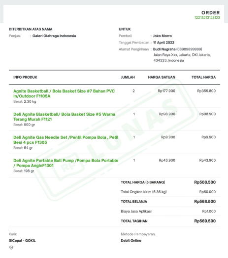

# Normalisasi Data

## Normalisasi Data

- normalisasi data adalah proses atau tahapan dalam membuat basis data, yang bertujuan untuk menghilangkan data redundancy / ganda dan data yang tidak konsisten
- aturan dalam normalisasi data adalah membagi tabel besar menjadi tabel yang lebih kecil, dan menghubungkan menggunakan relasi.

---

## Bentuk Normal Basis Data

- pencetus relational model, Edgar Codd mengajukan teori normalisasi data dengan mengenalkan praktek bentuk normal ke-1, lalu dilanjut dengan ke-2 dan bentuk normal ke-3
- https://en.wikipedia.org/wiki/Edgar_F._Codd
- sampai saat ini, bentuk normal basis data bisa sampai bentuk normal ke 6, namun kebanyakan pada prakteknya, bentuk normal basis data hanya sampai bentuk normal ke 3

---

## Contoh Kasus

- normalisasi data biasanya mengacu pada hasil akhir dari sebuah ruang lingkup, berbeda dengan yang awal kita lakukan sebelumnya
- normalisasi data biasanya datang dari kebutuhan akhir yang sudah selesai, lalu kita perlu membuat model data dari kebutuhan akhir tersebut
- misal, kita akan coba buat sebuah model data, dari kebutuhan laporan Order dari sebuah toko online

---

## Bentuk Tabel (Tidak Normal)

- https://docs.google.com/spreadsheets/d/1epqlWZiTkCmAWJRy_h2K35PjO9f60vVR6uDbKSRjK9k/edit?usp=sharing
- <a href="../assets/table/Bentuk Tidak Normal.html">Bentuk Tidak Normal</a>