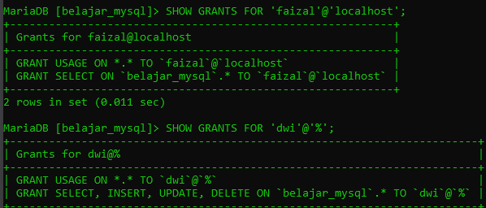

# User Management

---

## Root User

- Secara default, mysql membuat root user sebagai super administrator
- Namun best practice nya, saat kita menjalankan MySQL dengan aplikasi yang kita buat, sangat disarankan tidak menggunakan user root
- Lebih baik kita buat user khusus untuk tiap aplikasi, bahkan kita bisa batasi hak akses user tersebut, seperti hanya bisa melakukan SELECT, dan tidak boleh melakukan INSERT, UPDATE atau DELETE

---

## Hak Akses dan User

- Dalam user management MySQL, kita akan mengenal istilah Hak Akses dari User

---

## Daftar Hak Akses

- Ada banyak sekali hak akses di MySQL
- Kita bisa melihatnya di daftar tabel yang terdapat di halaman berikut :
- https://dev.mysql.com/doc/refman/8.0/en/grant.html

---

## Membuat/Menghapus User

- localhost / ip address
- % : bisa diakses dilocalhost / ip address

```sql
CREATE USER 'faizal'@'localhost';
CREATE USER 'dwi'@'%';

DROP USER 'faizal'@'localhost';
DROP USER 'dwi'@'%';
```


---

## Menambah/Menghapus Hak Akses ke User

```sql
GRANT SELECT ON belajar_mysql.* TO 'faizal'@'localhost';
GRANT SELECT, INSERT, UPDATE, DELETE ON belajar_mysql.* TO 'dwi'@'%';
```

```sql
SHOW GRANTS FOR 'faizal'@'localhost';
SHOW GRANTS FOR 'dwi'@'%';
```



```sql
REVOKE SELECT ON belajar_mysql.* FROM 'faizal'@'localhost';
REVOKE SELECT, INSERT, UPDATE, DELETE ON belajar_mysql.* FROM 'dwi'@'%';
```

---

## Mengubah Password untuk User

```sql
SET PASSWORD FOR 'faizal'@'localhost' = 'Rahasia123';
SET PASSWORD FOR 'dwi'@'%' = 'rahasia';
```

### bisa

```sql
ALTER USER 'faizal'@'localhost' IDENTIFIED BY 'Rahasia123';
ALTER USER 'dwi'@'%' IDENTIFIED BY 'rahasia';
```

